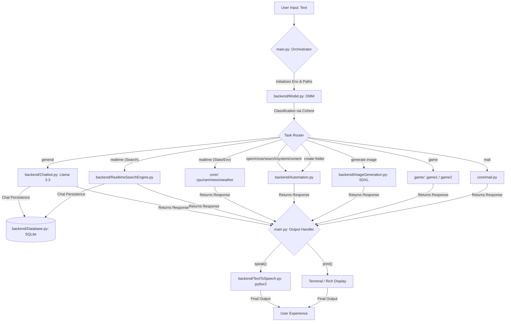

# Friday AI Assistant

Friday is a modular, high-performance personal AI assistant built with Python. It features a decentralized architecture where specialized modules handle conversation, real-time data, system automation, and entertainment.

## 🚀 Features

### 🤖 Intelligent Chat & Real-time Search
- **Conversational AI**: Powered by Groq (Llama 3.3) for fast, natural interactions.
- **Real-time Information**: Integrated DuckDuckGo search for up-to-the-minute news, weather, and facts.
- **Decision Logic**: Uses a Cohere-powered Decision Making Model (DMM) to route queries to the correct specialized tool.

### 🛠️ System Automation
- **App Management**: Open and close any installed application or website.
- **System Control**: Volume adjustment, muting, and screenshots via `pyautogui` and `pycaw`.
- **Content Creation**: Generate emails, scripts, or research papers directly into Notepad.

### 🎨 Creativity & Utility
- **Image Generation**: High-quality 4K image generation using Stable Diffusion XL via Hugging Face.
- **System Diagnostics**: Real-time CPU and RAM usage reports.
- **Email Integration**: Send emails directly through SMTP.
- **Camera Access**: Built-in photo capture application.

### 🎮 Gaming
- **Tic Tac Toe**: Intelligent AI-driven board game with hint support.
- **Ultra Breakout**: Advanced arcade game with levels, power-ups, and particle effects.

## 🔄 Project Flow

The following diagram illustrates the complete lifecycle of a user request within the Friday ecosystem:



## 🔄 Workflow Lifecycle

1.  **Input Phase**: User enters a text command into the terminal interface.
2.  **Analysis Phase**: `Model.py` (Decision Making Model) uses Cohere LLM to determine the intent. It supports 15+ classifications including `general`, `realtime`, `open`, `close`, `play`, `generate image`, `system`, `content`, `google search`, `youtube search`, `reminder`, `mail`, `game`, and `create folder`.
3.  **Routing Phase**: `main.py` parses the prefix and routes the query to the specialized module (Backend, Core, or Game).
4.  **Execution Phase**:
    *   **Conversational**: Llama 3.3 handles logic and knowledge queries, with history managed by `Database.py`.
    *   **Automation**: System-level commands (volume, screenshots, app management) and web automation via `Automation.py`.
    *   **Information**: Real-time news, weather, and system diagnostics (CPU/RAM).
    *   **Creativity**: SDXL for image generation and LLM for content writing.
    *   **Persistence**: SQLite-based chat logging ensures context across interactions.
5.  **Feedback Phase**: Responses are simultaneously displayed with rich terminal formatting and spoken aloud via the `TextToSpeech` engine.

## 🛠️ Setup & Requirements

1.  **Environment Variables**: Create a `.env` file in the root directory with the following keys:
    ```env
    GROQ_API_KEY=your_key_here
    COHERE_API_KEY=your_key_here
    HUGGINGFACE_API_KEY=your_key_here
    USERNAME=your_name
    EMAIL_PASSWORD=your_app_password
    NEWS_API=your_newsapi_org_key
    ```
2.  **Install Dependencies**:
    ```bash
    pip install -r requirements.txt
    ```
3.  **Run Assistant**:
    ```bash
    python main.py
    ```

## ⚖️ License
This project is for educational and personal automation purposes.
