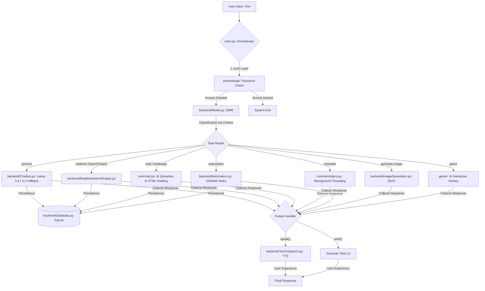

# Friday AI Assistant: Advanced Modular Ecosystem

Friday is a cutting-edge, high-performance personal AI assistant built with a decentralized Python architecture. It leverages a sophisticated multi-model strategy to provide real-time information, system automation, and intelligent communication.

## 🏗️ Architectural Overview

Friday operates on a **Research -> Strategy -> Execution** lifecycle, visualized in the following system architecture:


```mermaid
graph TD
    A[User Input: Text] --> B{main.py: Orchestrator}
    B -- "1. Auth Layer" --> C[authenticate: Password Check]
    C -- "Access Granted" --> D[backend/Model.py: DMM]
    C -- "Access Denied" --> E[System Exit]
    
    D -- "Classification via Cohere" --> F{Task Router}
    
    F -- "general" --> G[backend/Chatbot.py: Llama 3.3 / 3.1 Fallback]
    F -- "realtime (Search/Stats)" --> H[backend/RealtimeSearchEngine.py]
    F -- "mail / whatsapp" --> I[core/mail.py: AI Extraction & HTML Drafting]
    F -- "reminder" --> J[core/reminders.py: Background Threading]
    F -- "automation" --> K[backend/Automation.py: OS/Web Tasks]
    F -- "generate image" --> L[backend/ImageGeneration.py: SDXL]
    F -- "game" --> M[game/: AI Interactive Games]
    
    G & H & I & K -- "Persistence" --> N[(backend/Database.py: SQLite)]
    
    G & H & I & J & K & L & M -- "Collects Response" --> O{Output Handler}
    O -- "speak()" --> P[backend/TextToSpeech.py: TTS]
    O -- "print()" --> Q[Terminal / Rich UI]
    P & Q -- "User Experience" --> R[Final Response]
```

Friday's decentralized logic ensures that each module operates independently, while `main.py` maintains the state and security of the entire session.

---

## 🚀 Key Features & Capabilities

### 🔐 Security & User Experience
- **Biometric-Style Auth**: Password-protected startup (`rohit21`) with failed-attempt lockout.
- **Graceful Interruption**: Integrated `KeyboardInterrupt` (`Ctrl+C`) handling for safe system exits.
- **Voice Feedback**: Synchronized Text-to-Speech (TTS) for all assistant responses.

### 📧 Intelligent Communication (AI-Enhanced)
- **Natural Language Extraction**: Tell Friday "Send an email to X about Y," and it will automatically extract the recipient and subject without further prompts.
- **Professional Drafting**: Generates long-form, sophisticated emails with **bolded highlights** and perfect **HTML spacing**.
- **WhatsApp Integration**: Automated messaging with a "Review & Confirm" safety workflow.

### 🛠️ System & Task Automation
- **Multi-Threaded Reminders**: Set background timers with audible beep alerts and voice notifications.
- **Deep System Control**: Manage volume, take screenshots, and open/close any Windows application or website.
- **File Management**: Create and organize folders via voice or text commands.
- **Content Generation**: Write code, essays, or scripts directly to files.

### 🔍 Real-time Intelligence & Creativity
- **Hardware Monitoring**: Real-time tracking of CPU and RAM performance.
- **Live Information**: Instant access to weather, news, and Google/YouTube search results.
- **Creative Suite**: AI-powered 4K image generation using Stable Diffusion XL (Hugging Face).

### 🎮 Gaming Module
- **AI Games**: Collection of interactive games including Tic Tac Toe, Snake, and Rock Paper Scissors with intelligent logic.

---

## 💻 Technology Stack

- **Core**: Python 3.10+
- **LLMs**: Groq (Llama 3.3/3.1), Cohere (Command-R), Hugging Face (SDXL).
- **Automation**: `pyautogui`, `AppOpener`, `pywhatkit`, `selenium`.
- **Database**: SQLite (for persistent chat history and context).
- **UI/UX**: Rich (Terminal Formatting), `pyttsx3` (TTS), `PyQt5`.
- **Networking**: `smtplib` (Email), `requests` (APIs), `Flask` (Web integration).

---

## 🛠️ Setup & Installation

1.  **Clone the Repository** and navigate to the project root.
2.  **Configure Environment**: Create a `.env` file with the following:
    ```env
    USERNAME="YourName"
    GROQ_API_KEY="your_groq_key"
    COHERE_API_KEY="your_cohere_key"
    GEMINI_API_KEY="your_gemini_key"
    SENDER_EMAIL="your_gmail@gmail.com"
    EMAIL_PASSWORD="your_16_char_app_password"
    HUGGINGFACE_API_KEY="your_hf_key"
    OPENWEATHER_API_KEY="your_weather_key"
    NEWS_API="your_news_key"
    ```
3.  **Install Dependencies**:
    ```bash
    pip install -r requirements.txt
    ```
4.  **Run Friday**:
    ```bash
    python main.py
    ```

## ⚖️ License
This project is intended for personal automation and educational exploration of multi-model AI systems.
